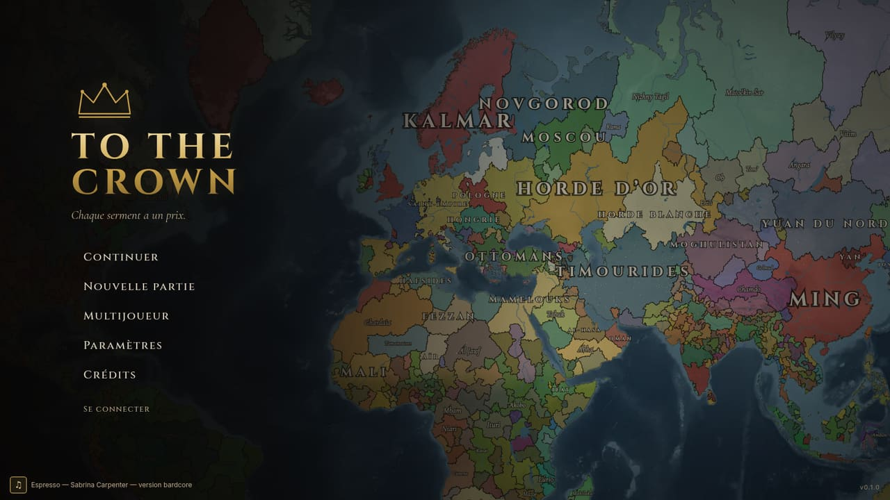
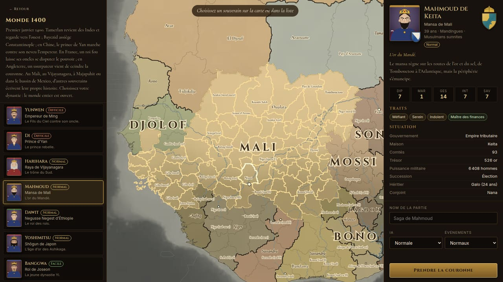
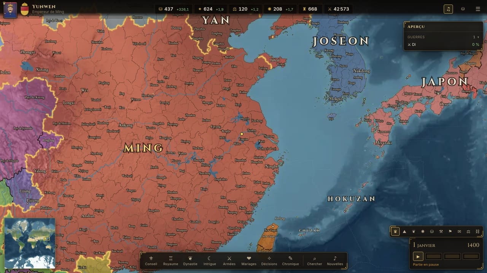
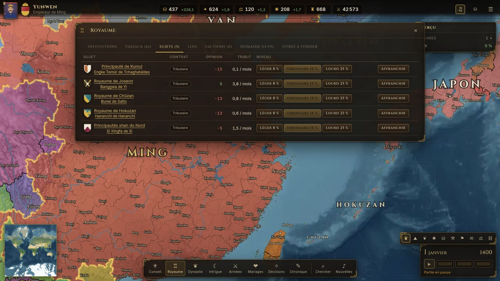
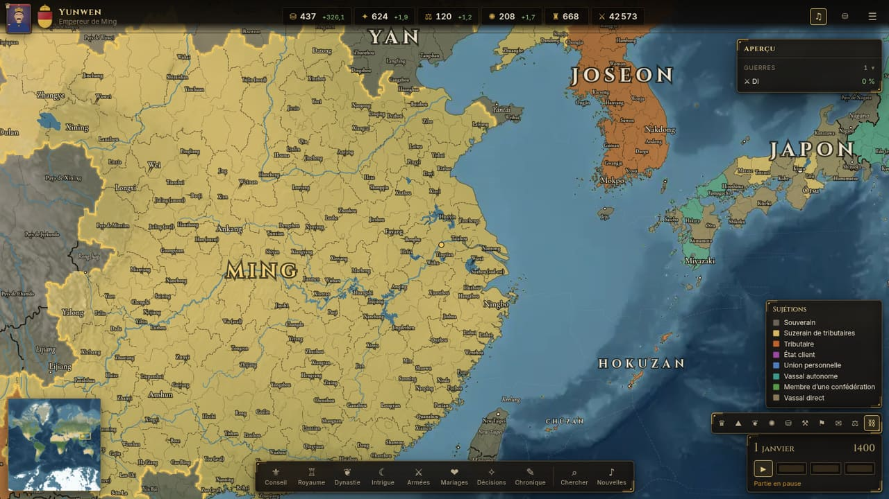

# To The Crown

> _Chaque serment a un prix._

**To The Crown** est un grand jeu de stratégie dynastique médiévale, jouable dans le navigateur, en solo ou à plusieurs (2 à 8 joueurs). Vous incarnez l'un des souverains du **monde réel au 1er janvier 1400** — roi de France, sultan ottoman, empereur Ming, mansa du Mali, tlatoani d'Azcapotzalco… — sur une carte de la Terre entière : mariez vos enfants, tenez vos vassaux et vos tributaires, complotez, guerroyez et, surtout, faites durer votre lignée. Si votre dynastie s'éteint, la partie est perdue.



## Le jeu

- **Scénario « Monde 1400 »**, 1er janvier 1400 : la Terre entière découpée en **5 747 provinces** et **360 zones maritimes** à partir de données géographiques réelles, **293 entités historiques** (chacune avec un niveau de fiabilité et une note), ~3 500 personnages vivants, 148 cultures, 29 confessions, 18 formes de gouvernement, 20 départs conseillés sur tous les continents. Voir [docs/WORLD_1400.md](docs/WORLD_1400.md).
- **Carte du monde** (MapLibre GL) : relief, fleuves, lacs, frontières exactes (provinces, vassaux, royaumes), votre royaume toujours repérable (liseré doré, indicateur hors écran, touche **H**), mini-carte, recherche mondiale (**Ctrl+F**), signets (**Ctrl+1…5**), historique de caméra (**Alt+←/→**), passage correct de l'antiméridien.
- **Institutions** : gouvernement (impôts et levées exigés des vassaux, plafond et coût de l'autorité, guerres privées, intitulés du conseil), légitimité du souverain décomposée, contrats de sujétion (vassal direct ou autonome, tributaire, État client, union personnelle, confédéré) avec tribut réglable et affranchissement. Voir [docs/POLITICAL_SYSTEM.md](docs/POLITICAL_SYSTEM.md).
- **Dynasties** : mariages, naissances, fertilité, éducation, précepteurs, successions (partage, primogéniture, élection, ancienneté), bâtards, héritier désigné.
- **Royaume** : titres de comté à empire, création de titres, vassaux et limite de domaine, autorité royale, lois de succession, factions (indépendance, prétendant, autonomie).
- **Économie** : impôts, développement, contrôle, 19 bâtiments, cour, dette.
- **Conseil** : chancelier, maréchal, intendant, maître-espion, érudit, chacun avec deux tâches.
- **Intrigue** : complots (assassinat, secrets, leviers, séduction, amitié, influence, revendications), secrets, leviers, scandales.
- **Guerre** : casus belli, alliés, levées et hommes d'armes, déplacement A*, batailles en phases, sièges, occupation, score de guerre, paix.
- **Événements** : 120 événements narratifs (dont 25 chaînes), effets affichés exactement tels qu'ils s'appliquent, stress selon la personnalité.
- **IA** complète pour les centaines de souverains non joués : mariages, guerres, alliances, complots, constructions.
- **Chronique** du monde et fin de partie avec score dynastique.
- **Multijoueur** autoritaire : salon avec code d'invitation, choix des souverains, reconnexion, vues privées par joueur (secrets, complots, événements), discussion.

| Choix du souverain (Mali)                    | Carte du monde (Ming)                        |
| -------------------------------------------- | -------------------------------------------- |
|  |  |
| **Sujets et tributs**                        | **Mode de carte « Sujétions »**              |
|           |    |

## Démarrage rapide (développement)

Prérequis : **Node 24**, **pnpm 10**, **PostgreSQL 15+**, Redis 7 (facultatif).

```bash
pnpm install
cp .env.example apps/server/.env      # puis ajuster DATABASE_URL et SESSION_SECRET
pnpm db:migrate                       # schéma PostgreSQL
pnpm db:seed                          # données de référence + comptes de démonstration
pnpm dev                              # serveur :3000 + client Vite :5173
```

Ouvrir http://localhost:5173. Comptes de démonstration (hors production) : `alice@tothecrown.local` et `bob@tothecrown.local`, mot de passe `couronne2026`.

## Avec Docker

```bash
cp .env.example .env
# Définir SESSION_SECRET (32 caractères minimum) dans .env
docker compose up --build
```

Le jeu est servi sur http://localhost:8080 (nginx → serveur de jeu, PostgreSQL et Redis inclus, migrations et données de référence appliquées au démarrage). Pour créer les comptes de démonstration : `SEED_DEMO_USERS=true` dans `.env`.

## Mettre le jeu en ligne

- **Vercel + Supabase, sans serveur** : le site est statique, la simulation tourne dans le navigateur de l'hôte, Supabase garde comptes, parties et sauvegardes et relie les joueurs en direct. Importer le dépôt sur Vercel suffit (`vercel.json`).
- **Render + Supabase** : serveur de jeu autoritaire allumé en continu.

Guide pas à pas : [docs/DEPLOYMENT.md](docs/DEPLOYMENT.md). En local, le mode sans serveur se lance avec `pnpm dev:supabase` (Supabase local : `supabase start`, puis les fichiers de `database/migrations` et `database/supabase/web_mode.sql`).

## Commandes

| Commande                                    | Rôle                                                                                                           |
| ------------------------------------------- | -------------------------------------------------------------------------------------------------------------- |
| `pnpm dev`                                  | Serveur (rechargement à chaud) et client                                                                       |
| `pnpm lint` · `pnpm typecheck`              | Qualité statique (ESLint, TypeScript strict)                                                                   |
| `pnpm test`                                 | Tests unitaires (moteur, contenu, client) et d'intégration (serveur)                                           |
| `pnpm test:e2e`                             | Scénarios Playwright (solo, événements, multijoueur, guerre)                                                   |
| `pnpm test:e2e:supabase`                    | Mêmes scénarios en mode sans serveur (Supabase local) + hôte navigateur                                        |
| `pnpm build`                                | Compilation du serveur (esbuild) et du client (Vite)                                                           |
| `pnpm build:supabase`                       | Site statique du mode sans serveur (`apps/web/dist`)                                                           |
| `pnpm simulate`                             | Simulation longue sans joueur avec vérification des invariants                                                 |
| `pnpm --filter @ttc/game-core check:events` | Tire chaque choix de chaque événement et vérifie l'état                                                        |
| `pnpm world:validate`                       | Valide le monde (géométrie, voisinages, hiérarchie des titres) et le contenu                                   |
| `pnpm world:build`                          | Reconstruit tout le monde depuis les sources géographiques (voir [docs/MAP_PIPELINE.md](docs/MAP_PIPELINE.md)) |
| `pnpm world:politics`                       | Réattribue seulement cultures, royaumes et titres (après une modification des entités historiques)             |
| `pnpm --filter @ttc/game-core perf`         | Mesure le coût d'un jour simulé à l'échelle du monde                                                           |

## Structure

```
apps/server      Fastify, Socket.IO, PostgreSQL (Drizzle), Redis — autorité de jeu
apps/web         React 19, MapLibre GL, Zustand — interface et carte du monde
packages/shared  Types, commandes (zod), protocole réseau, calendrier, i18n
packages/content Monde 1400 (provinces, entités historiques, cultures, confessions, gouvernements), scénario, traits, bâtiments, événements, textes
tools/worldgen   Pipeline géospatial reproductible (Natural Earth + relief → provinces, géométries, tuiles)
packages/game-core  Simulation déterministe pure (aucune E/S)
tests/e2e        Playwright
database         Migrations SQL versionnées ; `supabase/web_mode.sql` (API du mode sans serveur)
infra            Dockerfile, nginx
docs             Conception, architecture, multijoueur, base de données, direction artistique, tests
```

## Documentation

- [Plan directeur et avancement](docs/MASTER_PLAN.md)
- [Conception du jeu](docs/GAME_DESIGN.md)
- [Architecture](docs/ARCHITECTURE.md)
- [Le monde de 1400](docs/WORLD_1400.md)
- [Pipeline de la carte](docs/MAP_PIPELINE.md)
- [Système politique](docs/POLITICAL_SYSTEM.md)
- [Sources de données et licences](docs/DATA_SOURCES.md)
- [Multijoueur et protocole](docs/MULTIPLAYER.md)
- [Base de données et sauvegardes](docs/DATABASE.md)
- [Direction artistique](docs/ART_DIRECTION.md)
- [Tests](docs/TESTING.md)
- [Mise en ligne](docs/DEPLOYMENT.md)
- [Écrire des événements](docs/EVENTS.md)

## Licence et crédits

Textes, blasons, portraits, interface, effets sonores et musique générée sont créés pour ce projet ; aucun élément n'est repris d'un jeu existant. La géographie provient de données libres (Natural Earth, domaine public ; relief des Terrain Tiles d'AWS, voir [docs/DATA_SOURCES.md](docs/DATA_SOURCES.md)) ; les frontières de 1400 sont reconstituées pour le jeu, jamais copiées d'une carte moderne ou propriétaire. La musique de fond par défaut (`apps/web/public/music`) se compose de reprises « bardcore » de titres de Sabrina Carpenter, qui restent la propriété de leurs auteurs : vérifiez vos droits avant toute diffusion publique, ou choisissez « Musique générée » dans les paramètres. Polices sous licence SIL OFL 1.1 : Cinzel (Natanael Gama), Cormorant Garamond (Christian Thalmann), Inter (Rasmus Andersson).
