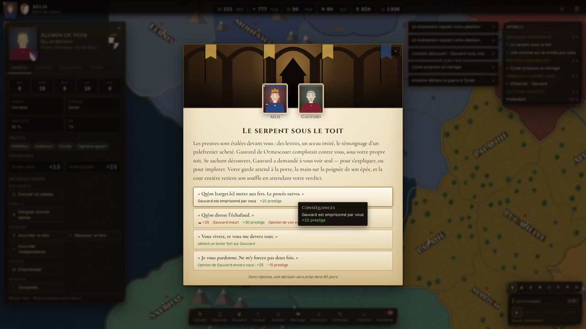
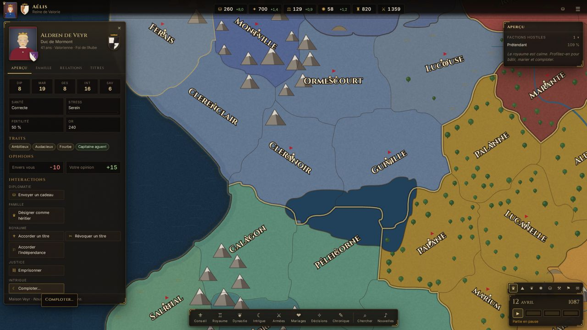

# To The Crown

> *Chaque serment a un prix.*

**To The Crown** est un grand jeu de stratégie dynastique médiévale, jouable dans le navigateur, en solo ou à plusieurs (2 à 8 joueurs). Vous incarnez un souverain du continent imaginaire de **Caldria** au lendemain de la mort du Haut-Roi : mariez vos enfants, tenez vos vassaux, complotez, guerroyez et, surtout, faites durer votre lignée. Si votre dynastie s'éteint, la partie est perdue.


## Le jeu

- **Scénario « La Couronne brisée »**, 12 avril 1087 : 180 comtés, 10 royaumes, 3 empires, 12 grandes maisons, ~680 personnages vivants générés, 8 cultures, 6 confessions.
- **Dynasties** : mariages, naissances, fertilité, éducation, précepteurs, successions (partage, primogéniture, élection, ancienneté), bâtards, héritier désigné.
- **Royaume** : titres de comté à empire, création de titres, vassaux et limite de domaine, autorité royale, lois de succession, factions (indépendance, prétendant, autonomie).
- **Économie** : impôts, développement, contrôle, 19 bâtiments, cour, dette.
- **Conseil** : chancelier, maréchal, intendant, maître-espion, érudit, chacun avec deux tâches.
- **Intrigue** : complots (assassinat, secrets, leviers, séduction, amitié, influence, revendications), secrets, leviers, scandales.
- **Guerre** : casus belli, alliés, levées et hommes d'armes, déplacement A*, batailles en phases, sièges, occupation, score de guerre, paix.
- **Événements** : 120 événements narratifs (dont 25 chaînes), effets affichés exactement tels qu'ils s'appliquent, stress selon la personnalité.
- **IA** complète pour les ~140 souverains non joués : mariages, guerres, alliances, complots, constructions.
- **Chronique** du continent et fin de partie avec score dynastique.
- **Multijoueur** autoritaire : salon avec code d'invitation, choix des souverains, reconnexion, vues privées par joueur (secrets, complots, événements), discussion.

| Choix du souverain | Événement | Fiche et interactions |
| --- | --- | --- |
|  |  |  |

## Démarrage rapide (développement)

Prérequis : **Node 24**, **pnpm 10**, **PostgreSQL 15+**, Redis 7 (facultatif).

```bash
pnpm install
cp .env.example apps/server/.env      # puis ajuster DATABASE_URL et SESSION_SECRET
pnpm db:migrate                       # schéma PostgreSQL
pnpm db:seed                          # données de référence + comptes de démonstration
pnpm dev                              # serveur :3000 + client Vite :5173
```

Ouvrir http://localhost:5173. Comptes de démonstration (hors production) : `alice@tothecrown.local` et `bob@tothecrown.local`, mot de passe `couronne2026`.

## Avec Docker

```bash
cp .env.example .env
# Définir SESSION_SECRET (32 caractères minimum) dans .env
docker compose up --build
```

Le jeu est servi sur http://localhost:8080 (nginx → serveur de jeu, PostgreSQL et Redis inclus, migrations et données de référence appliquées au démarrage). Pour créer les comptes de démonstration : `SEED_DEMO_USERS=true` dans `.env`.

## Commandes

| Commande | Rôle |
| --- | --- |
| `pnpm dev` | Serveur (rechargement à chaud) et client |
| `pnpm lint` · `pnpm typecheck` | Qualité statique (ESLint, TypeScript strict) |
| `pnpm test` | Tests unitaires (moteur, contenu, client) et d'intégration (serveur) |
| `pnpm test:e2e` | Scénarios Playwright (solo, événements, multijoueur, guerre) |
| `pnpm build` | Compilation du serveur (esbuild) et du client (Vite) |
| `pnpm simulate` | Simulation longue sans joueur avec vérification des invariants |
| `pnpm --filter @ttc/game-core check:events` | Tire chaque choix de chaque événement et vérifie l'état |
| `pnpm world:generate` · `pnpm world:validate` | Génère / valide la carte de Caldria |
| `pnpm --filter @ttc/game-core scenario:generate` | Régénère le scénario de 1087 |

## Structure

```
apps/server      Fastify, Socket.IO, PostgreSQL (Drizzle), Redis — autorité de jeu
apps/web         React 19, PixiJS 8, Zustand — interface et rendu de la carte
packages/shared  Types, commandes (zod), protocole réseau, calendrier, i18n
packages/content Monde, scénario, cultures, confessions, traits, bâtiments, événements, textes
packages/game-core  Simulation déterministe pure (aucune E/S)
tests/e2e        Playwright
database         Migrations SQL versionnées
infra            Dockerfile, nginx
docs             Conception, architecture, multijoueur, base de données, direction artistique, tests
```

## Documentation

- [Plan directeur et avancement](docs/MASTER_PLAN.md)
- [Conception du jeu](docs/GAME_DESIGN.md)
- [Architecture](docs/ARCHITECTURE.md)
- [Multijoueur et protocole](docs/MULTIPLAYER.md)
- [Base de données et sauvegardes](docs/DATABASE.md)
- [Direction artistique](docs/ART_DIRECTION.md)
- [Tests](docs/TESTING.md)
- [Écrire des événements](docs/EVENTS.md)

## Licence et crédits

Monde, personnages, textes, cartes, blasons, portraits, effets sonores et musique générée sont créés pour ce projet ; aucun élément n'est repris d'un jeu existant. La musique de fond par défaut (`apps/web/public/music`) se compose de reprises « bardcore » de titres de Sabrina Carpenter, qui restent la propriété de leurs auteurs : vérifiez vos droits avant toute diffusion publique, ou choisissez « Musique générée » dans les paramètres. Polices sous licence SIL OFL 1.1 : Cinzel (Natanael Gama), Cormorant Garamond (Christian Thalmann), Inter (Rasmus Andersson).
